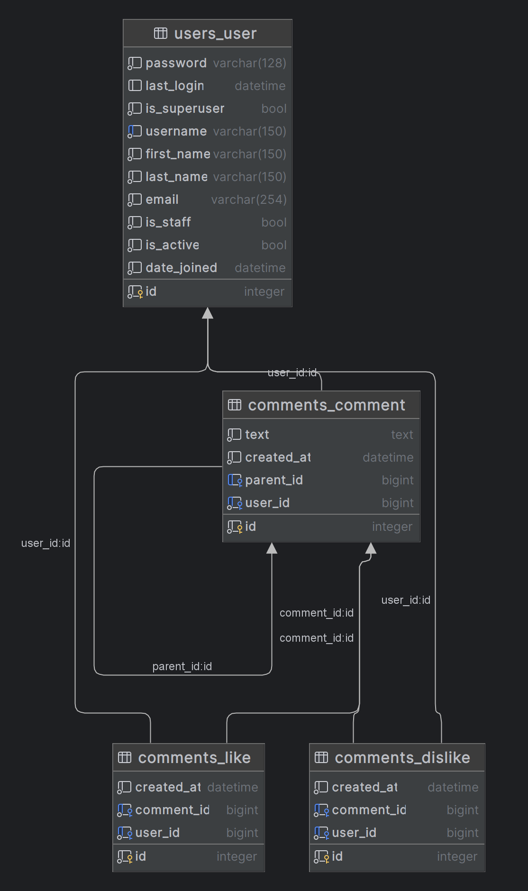

# SPA Comments App

Welcome to the SPA Comments App! This guide will walk you through the setup and installation process to get the app up and running on your local machine.

## Prerequisites

Before you begin, ensure you have the following installed on your machine:
- Docker
- Docker Compose

## Setup and Installation

Follow these steps to set up the Comments App:

### 1. Clone the Repository

Start by cloning the repository to your local machine:

```bash
git clone <repository-url>
```
Replace <repository-url> with the actual URL of the repository.

2. Navigate to the Project Directory
Change to the project's root directory:


```bash
cd dzen_test_task
```
3. Configure Environment Variables
Rename the .env.sample file to .env in the project's root directory. Update the file with your specific configurations:

```plaintext
POSTGRES_DB=your_database_name
POSTGRES_USER=your_database_user
POSTGRES_PASSWORD=your_database_password
DJANGO_SECRET_KEY=your_django_secret_key
DJANGO_SUPERUSER_USERNAME=your_user_name
DJANGO_SUPERUSER_EMAIL=your_email
DJANGO_SUPERUSER_PASSWORD=your_password
NEO4J_AUTH=neo4j/your_password
```
Make sure to replace placeholder values with your actual database, Django, and Neo4j configurations. Note: The POSTGRES_HOST should remain as db.

4. Build and Run Docker Containers
Build and launch the Docker containers using the following command:

```bash
docker-compose up -d --build
```
If the services don't start on the first try, it might be due to the PostgreSQL database not connecting immediately in Docker. Wait for 10-15 seconds and execute the command again:

```bash
docker-compose up -d
```
5. Accessing the App
The Comments App should now be accessible at http://localhost:8000. The admin interface is available at http://localhost:8000/admin with the credentials:

```plaintext
Username: DJANGO_SUPERUSER_USERNAME
Password: DJANGO_SUPERUSER_PASSWORD
```
6. Obtaining a JWT Token
First, navigate to http://localhost:8000/user/login/ to obtain a JWT token. Insert the token into the ModHeader extension in your browser to access other endpoints:

```plaintext
Header Name: Authorization
Header Value: Bearer <token>
```
Replace <token> with the token you received.

7. Testing the App
You're all set! Visit http://localhost:8000/comments/ to test the app's functionality.

8. Viewing Metrics in Neo4j
To see the metrics data written to Neo4j (GraphDB) using RabbitMQ (pika), visit http://localhost:7474/.
9. Caching is implemented using redis
10. DB Schema: 

Conclusion
You have successfully set up and launched the SPA Comments App. Enjoy exploring its features and functionalities!


